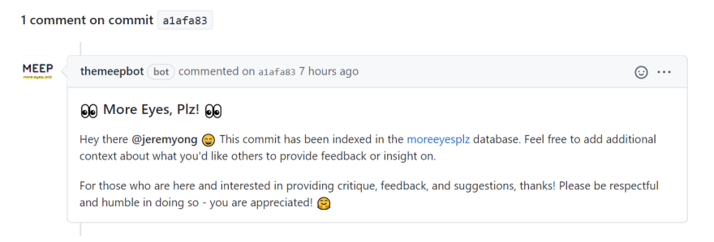

<!-- PROJECT LOGO -->
<br />
<p align="center">
  <a href="https://github.com/moreeyesplz">
    
  </a>

  <h1 align="center" style="border:none" >More Eyes, Plz!</h1>

  <p align="center">
    A simple way to crowdsource feedback on your GitHub commits.
    <br />
    <br />
    <a href="http://moreeyesplz.com/">Go To Site</a>
    ·
    <a href="https://github.com/marketplace/actions/meep-scanner">Get MEEP Scanner</a>
    ·
    <br />
    <a href="#traffic_light-roadmap">Report Bug</a>
    ·
    <a href="#traffic_light-roadmap">Request Feature</a>
  </p>
  
<br/><hr/><br/>

<!-- TABLE OF CONTENTS -->

## Table of Contents

- :sparkles: [About the Project](#sparkles-about-the-project)
  - :jigsaw: [How does it all work?](#jigsaw-how-does-it-all-work)
  - :wrench: [Built With](#wrench-built-with)
- :rocket: [Getting Started](#rocket-getting-started)
  - :ocean: [Workflow](#ocean-workflow)
- :traffic_light: [Roadmap](#traffic_light-roadmap)
- :handshake: [Contributing](#handshake-contributing)
- :phone: [Contact](#phone-contact)
- :books: [Resources](#books-resources)

<br /><hr/><br/>

<!-- ABOUT THE PROJECT -->

## :sparkles: About The Project

This is a weekend project built by [Jeremy](https://github.com/jeremyong) and [Hannah Ong](https://github.com/duchess-toffee) as a submission to the [Dev.to's GitHub Actions Hackathon](https://dev.to/devteam/announcing-the-github-actions-hackathon-on-dev-3ljn). We thought that in the spirit of Dev.to and GitHub's community, that a community-led resource to help people like myself get feedback on GitHub commits would be a great submission. It went on to win the grand prize in the ["Maintainer Must-Haves"](https://dev.to/devteam/github-actions-hackathon-winners-announced-38o2) category.

This `README` in particular will be the main documentation that explains how all the repos within [More Eyes, Plz](https://github.com/moreeyesplz) are connected.

<br/>

### :jigsaw: How Does It All Work?

To best explain how all the repos within [More Eyes, Plz](https://github.com/moreeyesplz) are connected, I will provide a walkthrough of what happens after someone [gets started](#rocket-getting-started).

1. The [meep_scanner](https://github.com/moreeyesplz/meep_scanner) will run on every push. It will "scan" each commit for `[MEEP]`. If the commit contains `[MEEP]`, and the repo is public, then the [meep_scanner](https://github.com/moreeyesplz/meep_scanner) will send metadata to a Google Cloud Function.
2. The [meeper](https://github.com/moreeyesplz/meeper) will now recieve the metadata from the [meep_scanner](https://github.com/moreeyesplz/meep_scanner) via the Google Cloud Function. This repo is where the bot credentials are hidden as enviornment variables. It will then create the issue on the [meeps](https://github.com/moreeyesplz/meeps/issues) repository as an issue, which will feed the [More Eyes, Plz!](http://moreeyesplz.com/) website In addition, it also creates the initial commit comment:



3. The [themeepbot](https://github.com/moreeyesplz/themeepbot) is the webhook responder. It listens to the commit comments for a command. Currently the only command running is `close` written as `[MEEP close]`. When this is sent by the author, then themeepbot will close the issue and it will be removed from the website.

_Although the [meep_scanner](https://github.com/moreeyesplz/meep_scanner) is the public-facing GitHub Action that is in the marketplace, [meeper](https://github.com/moreeyesplz/meeper), and [themeepbot](https://github.com/moreeyesplz/themeepbot) are also GitHub Actions._

The above walkthrough mainly outlines the backend, but I think it makes sense to talk about the frontend user flow separately.

1. When a user first encounters the [More Eyes, Plz!](https://moreeyesplz.com/) website, they will be taken to a landing/login page. That is because we currently do not have a GitHub access token for the user/session. After they authenticate via GitHub OAuth / Octokit, we store it in local storage until the user logs out.
2. Once the user logs in, the site will fetch the issues from the [meeps](https://github.com/moreeyesplz/meeps/issues) repository and the list of all [tags](https://github.com/moreeyesplz/meeps/labels) and display them on the site. The cards re-fetch when the filter search string changes.

<br/>

### :wrench: Built With

The frontend (website) is built with [React](https://reactjs.org/), [TypeScript](https://www.typescriptlang.org/), [Material-UI](http://material-ui.com/), and [unDraw](https://undraw.co/illustrations).
The backend (GitHub Actions) is built with [Node](https://nodejs.org/en/), [Octokit](https://octokit.github.io/rest.js/v18), and [Google Cloud Functions](https://cloud.google.com/functions).

<br/>

<!-- GETTING STARTED -->

## :rocket: Getting Started

For each repository you wish to potentially request feedback on, please performing the following steps:

#### 1. Add topics to your repository

Topics added help others discover your requests more easily through filters. To do this, hit the settings wheel at the top right of your repository's home page. Then, add topics that pertain to your code. This could be the programming language, a framework or library you're using, or any other general tag.


<br/>

#### 2. Install the MEEP Scanner action

In your repository, make the file `.github/workflows/meep.yml` with the following contents:

```
name: meep_scanner
on: [push]

jobs:
  meep_scan:
    runs-on: ubuntu-latest
    steps:
    - uses: moreeyesplz/meep_scanner@master
      with:
        github-token: ${{ secrets.GITHUB_TOKEN }}
```

This will cause the scanner to run each time you push to the repository.

<br/>

#### 3. Tag commits you'd like feedback on with `[MEEP]` or `[meep]`

When you write a commit you'd like another set of eyes on, include the text `[MEEP]` or `[meep]` somewhere in your commit message. For best results, it's recommended that you:

- **DO** include some context about what you'd like insight on
- **DON'T** request feedback on overly trivial changes

<br/>

#### 4. Follow the discussion!

Your commit will be listed along with the repository tags on the _More Eyes, Plz!_ [website](https://moreeyesplz.com/). Feedback will be provided in the form of comments on your commit within Github. You'll receive notifications when people make comments or ask for clarification.

<br/>

#### 5. Thank your reviewers!

Don't forget to thank your reviewers with a kind note or a healthy number of emojis.

<br/>

### :ocean: Workflow

These are internal notes for myself to remember the frontend workflow for this project:

1. `npm run start` to start the react server for testing
2. `git add`, `git commit`, `git fetch`, `git rebase`, `git push` to send the data to the repo.
3. Go to the [repo]() click on **Actions**, navigate to **Workflows** > **deploy**.
4. Click the **Run workflow** dropdown and click **Run workflow** to deploy the site to production.

<br/><hr/><br/>

<!-- ROADMAP -->

## :traffic_light: Roadmap

See the table below for a list of proposed features (and known issues) by repositories.

| Repository                                                                    | Description                                                | Link                                                                           |
| ----------------------------------------------------------------------------- | ---------------------------------------------------------- | ------------------------------------------------------------------------------ |
| [moreeyesplz.github.io](https://github.com/moreeyesplz/moreeyesplz.github.io) | Public-facing website aggregating and displaying meeps     | [issues/features](https://github.com/moreeyesplz/moreeyesplz.github.io/issues) |
| [meep_scanner](https://github.com/moreeyesplz/meep_scanner)                   | GH Action that scans your public repo commits for "[MEEP]" | [issues/features](https://github.com/moreeyesplz/meep_scanner/issues)          |
| [meeper](https://github.com/moreeyesplz/meeper)                               | Internal action which acceps meeps from meep_scanner       | [issues/features](https://github.com/moreeyesplz/meeper/issues)                |
| [themeepbot](https://github.com/moreeyesplz/themeepbot)                       | Webhook responder for themeepbot                           | [issues/features](https://github.com/moreeyesplz/themeepbot/issues)            |

<br/><hr/><br/>

<!-- CONTRIBUTING -->

## :handshake: Contributing

Contributions are what make the open source community such an amazing place to be learn, inspire, and create. Any contributions you make are **greatly appreciated**.

1. Fork the Project
2. Create your Feature Branch (`git checkout -b feature/AmazingFeature`)
3. Commit your Changes (`git commit -m 'Add some AmazingFeature'`)
4. Push to the Branch (`git push origin feature/AmazingFeature`)
5. Open a Pull Request

<br/><hr/><br/>

<!-- CONTACT -->

## :phone: Contact

:mega: [@duchess_toffee](https://twitter.com/duchess_toffee) · [@m_ninepoints](https://twitter.com/m_ninepoints)
<br/>
:mailbox: hchai1991@gmail.com · jeremycong@gmail.com

:octocat: [More Eyes, Plz! Github Repo](https://github.com/moreeyesplz)

<br/><hr/><br/>

<!-- ACKNOWLEDGEMENTS -->

## :books: Resources

- [React](https://reactjs.org/)
- [TypeScript](https://www.typescriptlang.org/)
- [Material-UI](http://material-ui.com/)
- [unDraw](https://undraw.co/illustrations)
- [Node](https://nodejs.org/en/)
- [Octokit](https://octokit.github.io/rest.js/v18)
- [Google Cloud](https://cloud.google.com/)
- [Google Cloud Function](https://cloud.google.com/functions)
